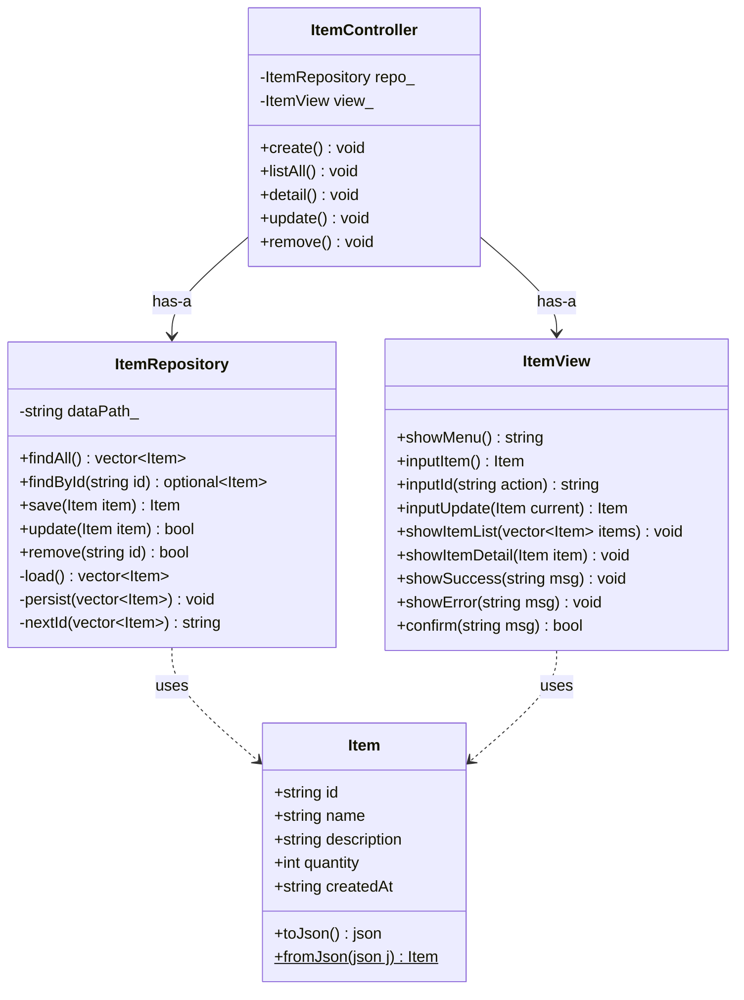

# ConsoleMVC — PoC 1: MVC 패턴 구조 검증

반도체 시료 생산주문관리 시스템(SampleOrderSystem) 구현에 앞서,
**Model / Repository / View / Controller** 레이어 분리가 올바르게 동작하는지 검증하는 PoC입니다.

---

## 목차

1. [이 PoC의 목적](#1-이-poc의-목적)
2. [핵심 학습 포인트](#2-핵심-학습-포인트)
3. [레이어 구조](#3-레이어-구조)
4. [클래스 다이어그램](#4-클래스-다이어그램)
5. [핵심 코드 설명](#5-핵심-코드-설명)
6. [코드 동작 흐름](#6-코드-동작-흐름)
7. [프로젝트 구조](#7-프로젝트-구조)
8. [빌드 및 실행](#8-빌드-및-실행)
9. [입출력 예시](#9-입출력-예시)

---

## 1. 이 PoC의 목적

| 검증 항목 | 방법 | 본 프로젝트 연관도 |
|---|---|---|
| Model/Repository/View/Controller 레이어 분리 | Item CRUD 구현 후 각 레이어 역할 위반 검사 | SampleOrderSystem 전체 아키텍처 기반 |
| `std::optional<T>` 반환 패턴 | `findById()` 실패 시 nullptr 대신 `std::nullopt` | `SampleService`, `OrderService` 전반 사용 |
| JSON 파일 영속성 (CRUD) | 등록→조회→수정→삭제 후 파일 확인 | Repository 레이어 이식 |
| 디스패치 테이블 패턴 | `unordered_map<string, function<void()>>` 메뉴 처리 | Controller 분기 처리 방식 |
| Windows 한글 콘솔 | `SetConsoleOutputCP(CP_UTF8)` + `/utf-8` | 모든 PoC/본 프로젝트 공통 |

> 이 PoC에서 검증된 MVC + Repository 구조가 SampleOrderSystem에 그대로 이식됩니다.

---

## 2. 핵심 학습 포인트

### 이 PoC에서 다루는 C++ 개념

| 개념 | 설명 | 사용된 곳 |
|---|---|---|
| `std::optional<T>` | 값이 없을 수 있는 반환형 (C++17). 조회 실패 시 `std::nullopt` 반환 | `ItemRepository::findById` |
| `std::function<void()>` | 호출 가능한 객체를 저장하는 타입 (람다/함수 포인터 모두 저장 가능) | `main.cpp` 디스패치 테이블 |
| `std::unordered_map` | 해시 기반 맵. `std::map`보다 O(1) 평균 탐색 | `main.cpp` 메뉴→함수 매핑 |
| `struct` vs `class` | `struct`는 기본 public — DTO(데이터 전달 객체)에 적합 | `model/Item.h` |
| trailing underscore (`_`) | private 멤버 변수 구분 관례 (`dataPath_`) | `ItemRepository`, `ItemController` |
| `j.at("key")` | 키 없으면 예외 발생 (안전). `j["key"]`는 null 삽입 (위험) | `Item::fromJson` |
| `SetConsoleOutputCP(CP_UTF8)` | Windows 콘솔에서 한글 출력 설정 | `main.cpp` |

---

### 설계 결정 사항

- **디스패치 테이블 (`unordered_map`) vs if-else 분기**
  - if-else는 메뉴가 늘 때마다 분기 추가가 필요하고 실수가 생김
  - 테이블 방식은 메뉴 추가 = 한 줄 추가만 하면 됨 — 본 프로젝트 Controller에서 동일 패턴 사용

- **Repository에서 `load → 수정 → persist` 일관 패턴**
  - 모든 쓰기 연산(save/update/remove)이 파일 전체를 읽고 전체를 씀
  - 데이터가 소규모(수백 건)이므로 단순성 > 성능 — 인메모리 캐시 없이 항상 파일이 정답

- **View에서 모든 `cin/cout` 격리**
  - Controller와 Repository에는 `cout`이 단 한 줄도 없음
  - 이렇게 해야 테스트 시 화면 출력 없이 Controller/Repository만 단독 테스트 가능

- **`std::optional` vs 예외 vs nullptr**
  - `findById` 실패는 "예외 상황"이 아니라 "정상 흐름" → 예외보다 `optional`이 적합
  - `nullptr` 반환은 포인터를 반환해야 해 소유권 문제가 생김 → `optional<T>` 사용

---

### 흔한 실수 / 주의사항

- **Controller에서 `cout` 직접 사용**
  "빠르게 출력하고 싶다"는 이유로 Controller에 `cout`을 넣으면 레이어 규칙 위반.
  반드시 `view_.showError()` / `view_.showSuccess()`로 View에 위임해야 함

- **View에서 비즈니스 판단 수행**
  `if (item.stock == 0)` 같은 재고 판단을 View에 쓰면 안 됨.
  View는 데이터를 받아서 표시만 하고, 판단은 Controller/Service에서 해야 함

- **`j["key"]`와 `j.at("key")` 혼용**
  `j["key"]`는 키가 없으면 null을 자동 삽입해서 JSON 파일을 오염시킴.
  읽을 때는 반드시 `j.at("key").get<Type>()`을 사용할 것

- **작업 디렉터리 문제**
  탐색기에서 `.exe` 더블클릭 시 작업 디렉터리가 `exe` 위치가 됨 → `data/items.json` 경로 불일치.
  VS에서 F5 실행하거나 `LocalDebuggerWorkingDirectory=$(ProjectDir)` 설정 필수

---

### 본 프로젝트(SampleOrderSystem)와의 연관

| 이 PoC에서 검증한 내용 | 본 프로젝트 적용 위치 |
|---|---|
| MVC + Repository 4계층 분리 | 전체 아키텍처에 그대로 적용 (`Sample/Order/ProductionJob` 각각) |
| `std::optional<T>` 반환 패턴 | `SampleService::findById`, `OrderService::findById` 등 전반 사용 |
| JSON 파일 CRUD (load→수정→persist) | `SampleRepository`, `OrderRepository`, `ProductionRepository` 동일 패턴 |
| `unordered_map` 디스패치 테이블 | Controller의 메뉴 분기 처리에 동일 방식 적용 |

---

## 3. 레이어 구조

```
┌──────────────────────────────────────────┐
│  View  (ItemView)                        │
│  · cout / cin 만 담당                    │
│  · 화면 출력 + 사용자 입력 수집          │
└───────────────┬──────────────────────────┘
                │ 데이터 전달 (struct Item)
┌───────────────▼──────────────────────────┐
│  Controller  (ItemController)            │
│  · 흐름 제어만 담당                      │
│  · View 에서 받은 입력 → Repository 전달 │
│  · Repository 결과 → View 에 전달        │
└───────────────┬──────────────────────────┘
                │ CRUD 호출
┌───────────────▼──────────────────────────┐
│  Repository  (ItemRepository)            │
│  · JSON 파일 읽기/쓰기만 담당           │
│  · findAll / findById / save / update    │
└───────────────┬──────────────────────────┘
                │ 직렬화/역직렬화
┌───────────────▼──────────────────────────┐
│  Model  (Item)                           │
│  · 순수 데이터 구조 (struct)             │
│  · toJson() / fromJson() 만 포함         │
└──────────────────────────────────────────┘
```

### 레이어별 금지 규칙

| 레이어 | 역할 | 절대 하면 안 되는 것 |
|---|---|---|
| **Model** | 데이터 정의 + JSON 변환 | `cout`, 파일 읽기, 비즈니스 판단 |
| **Repository** | 파일 CRUD | `cout`, 비즈니스 판단 |
| **Controller** | 흐름 제어 | `cout`, 직접 파일 접근 |
| **View** | 입출력 전담 | 비즈니스 로직, 파일 접근 |

---

## 4. 클래스 다이어그램



> `$` = static 메서드 | `optional~T~` = `std::optional<T>` | `vector~T~` = `std::vector<T>`

---

## 5. 핵심 코드 설명

### 5-1. Model — `Item`

```cpp
// ConsoleMVC/model/Item.h
struct Item {
    std::string id;           // "ITEM-001"
    std::string name;         // "실리콘 웨이퍼"
    std::string description;  // "12인치 300mm"
    int         quantity;     // 100
    std::string createdAt;    // "2026-07-15"

    nlohmann::json toJson() const;
    static Item fromJson(const nlohmann::json& j);
};
```

- `struct` 선언 — 멤버가 기본 public이므로 데이터 전달 객체(DTO)에 적합
- `toJson()` / `fromJson()`: 파일 저장·불러오기 시 JSON ↔ struct 변환만 담당

---

### 5-2. Repository — `ItemRepository`

```cpp
std::optional<Item> ItemRepository::findById(const std::string& id) const {
    auto items = load();
    for (const auto& item : items)
        if (item.id == id) return item;    // 찾으면 값 반환
    return std::nullopt;                   // 없으면 nullopt
}

Item ItemRepository::save(Item item) {
    auto items = load();          // 파일에서 전체 읽기
    item.id = nextId(items);      // ID 자동 생성 ("ITEM-001" ...)
    items.push_back(item);
    persist(items);               // 파일에 전체 다시 쓰기
    return item;
}

bool ItemRepository::remove(const std::string& id) {
    auto items = load();
    auto before = items.size();
    items.erase(
        std::remove_if(items.begin(), items.end(),
            [&id](const Item& i) { return i.id == id; }),
        items.end());             // erase-remove 이디엄
    if (items.size() == before) return false;
    persist(items);
    return true;
}
```

---

### 5-3. main.cpp — 디스패치 테이블

```cpp
const std::unordered_map<std::string, std::function<void()>> actions = {
    {"1", [&]{ controller.create();  }},
    {"2", [&]{ controller.listAll(); }},
    {"3", [&]{ controller.detail();  }},
    {"4", [&]{ controller.update();  }},
    {"5", [&]{ controller.remove();  }},
};

while (true) {
    std::string choice = view.showMenu();
    if (choice == "0") break;
    auto it = actions.find(choice);
    if (it != actions.end()) it->second();
    else view.showError("올바른 번호를 입력하세요.");
}
```

if-else 분기 대신 테이블 방식으로 메뉴를 처리합니다. 메뉴 항목 추가 시 테이블에 한 줄만 추가하면 됩니다.

---

## 6. 코드 동작 흐름

### 시나리오 A — 아이템 등록 (`1` 선택)

```
사용자: "1" 입력
  │
  ▼
main() → actions["1"]() → controller.create() 호출
  │
  ▼
[Controller] create()
  ├─ view_.inputItem()              ← [View] 이름/설명/수량 입력 요청
  │     반환: Item{name="웨이퍼", quantity=100}
  │
  ├─ item.name.empty() 검사
  │     비어있으면 → view_.showError() 후 return
  │
  ├─ repo_.save(item)               ← [Repository] 저장 요청
  │     ├─ load()     ← data/items.json 읽기
  │     ├─ nextId()   ← "ITEM-001" 채번
  │     ├─ push_back()
  │     └─ persist()  ← data/items.json 쓰기
  │
  └─ view_.showSuccess("등록 완료: ITEM-001")  ← [View] 출력
```

### 시나리오 B — 아이템 삭제 (`5` 선택)

```
사용자: "5" 입력
  │
  ▼
controller.remove() 호출
  ├─ view_.inputId("삭제")          ← [View] ID 입력
  ├─ repo_.findById("ITEM-002")     ← [Repository] 존재 확인
  │     없으면 → showError() 후 return
  ├─ view_.confirm("정말 삭제?")    ← [View] Y/N
  │     N → showSuccess("취소") 후 return
  ├─ repo_.remove("ITEM-002")       ← [Repository] 삭제
  └─ view_.showSuccess("삭제 완료") ← [View] 결과 출력
```

---

## 7. 프로젝트 구조

```
ConsoleMVC-JOYUSIK-21044893/
├── .gitignore
├── README.md
└── ConsoleMVC/
    ├── ConsoleMVC.vcxproj          ← VS 네이티브 프로젝트 (v145, C++20, x64)
    ├── ConsoleMVC.vcxproj.filters
    ├── main.cpp                    ← 진입점, 디스패치 테이블
    ├── model/
    │   ├── Item.h
    │   └── Item.cpp
    ├── repository/
    │   ├── ItemRepository.h
    │   └── ItemRepository.cpp
    ├── view/
    │   ├── ItemView.h
    │   └── ItemView.cpp
    ├── controller/
    │   ├── ItemController.h
    │   └── ItemController.cpp
    ├── third_party/
    │   └── json.hpp                ← nlohmann/json 3.11.3 (헤더 온리)
    └── data/                       ← 런타임 생성 (git 제외)
        └── items.json
```

### vcxproj 핵심 설정

| 항목 | 값 |
|---|---|
| PlatformToolset | v145 |
| LanguageStandard | stdcpp20 |
| CharacterSet | Unicode |
| AdditionalIncludeDirectories | `$(ProjectDir)` |
| AdditionalOptions | `/utf-8` |
| LocalDebuggerWorkingDirectory | `$(ProjectDir)` |

---

## 8. 빌드 및 실행

### Visual Studio (권장)

1. `ConsoleMVC\ConsoleMVC.vcxproj` 열기
2. 구성: `Release | x64`
3. **F7** 빌드 → **F5** 실행

> `data/items.json`은 최초 실행 시 자동으로 생성됩니다.

### MSBuild 터미널

```powershell
$msbuild = "C:\Program Files\Microsoft Visual Studio\18\Community\MSBuild\Current\Bin\MSBuild.exe"
& $msbuild "ConsoleMVC\ConsoleMVC.vcxproj" /p:Configuration=Release /p:Platform=x64

# ConsoleMVC\ 폴더에서 실행
cd ConsoleMVC
.\x64\Release\ConsoleMVC.exe
```

---

## 9. 입출력 예시

### 케이스 A — 아이템 등록 (정상)

**입력**:
```
선택 > 1
이름 > 실리콘 웨이퍼-8인치
설명 > 300mm 고순도 실리콘
수량 > 100
```
**출력**:
```
============================================================
 [완료] 아이템이 등록되었습니다. (ID: ITEM-001)
============================================================
```
**`data/items.json`**:
```json
[{ "id": "ITEM-001", "name": "실리콘 웨이퍼-8인치",
   "description": "300mm 고순도 실리콘", "quantity": 100,
   "created_at": "2026-07-15" }]
```

---

### 케이스 B — 빈 데이터 (목록 조회)

**입력**:
```
선택 > 2
```
**출력**:
```
============================================================
 아이템 목록 (총 0개)
------------------------------------------------------------
 등록된 아이템이 없습니다.
============================================================
```

---

### 케이스 C — ID 조회 실패 (없는 ID)

**입력**:
```
선택 > 3
조회할 ID > ITEM-999
```
**출력**:
```
 [오류] 존재하지 않는 ID입니다: ITEM-999
```

---

### 케이스 D — 삭제 취소 (N 선택)

**입력**:
```
선택 > 5
삭제할 ID > ITEM-001
정말 삭제하시겠습니까? (Y/N) > N
```
**출력**:
```
 [취소] 삭제가 취소되었습니다.
```

---

### 케이스 E — 잘못된 메뉴 번호

**입력**:
```
선택 > 9
```
**출력**:
```
 [오류] 올바른 번호를 입력하세요.
```

---

## 환경 정보

| 항목 | 내용 |
|---|---|
| 언어 | C++20 |
| IDE | Visual Studio 2025 Preview (v18) |
| Toolset | MSVC v145 |
| JSON | nlohmann/json 3.11.3 (헤더 온리) |
| 인코딩 | UTF-8 (`/utf-8` 컴파일 옵션) |
